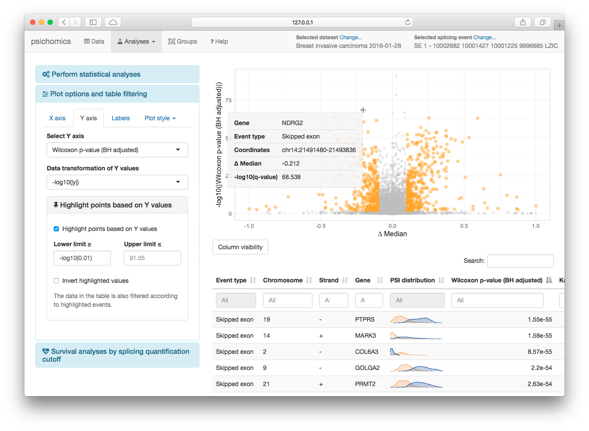

# psichomics

<!-- badges: start -->
[![Travis Build Status][travisIcon]][travis]
[![AppVeyor Build Status][appVeyorIcon]][appVeyor]
[![codecov][codecovIcon]][codecov]
<!-- badges: end -->

> **Original article:**
>
> Nuno Saraiva-Agostinho and Nuno L. Barbosa-Morais (2019). 
[psichomics: graphical application for alternative splicing quantification and analysis][article].
*Nucleic Acids Research*. 47(2), e7.

Interactive R package with an intuitive Shiny-based graphical 
interface for alternative splicing quantification and integrative analyses of
alternative splicing and gene expression based on 
[The Cancer Genome Atlas (TCGA)][TCGA], the 
[Genotype-Tissue Expression (GTEx) project][GTEx], 
[Sequence Read Archive (SRA)][SRA] and user-provided data.

*psichomics* interactively performs survival, dimensionality reduction and 
median- and variance-based differential splicing and gene expression analyses
that benefit from the incorporation of clinical and molecular sample-associated
features (such as tumour stage or survival). Interactive visual access to
genomic mapping and functional annotation of selected alternative splicing
events is also included.



## Table of Contents

* [Install and start running](#install-and-start-running)
    * [Bioconductor release](#bioconductor-release)
    * [GitHub version](#github-version)
* [Tutorials](#tutorials)
* [Workflow](#workflow)
    * [Data input](#data-input)
        * [Splicing quantification](#splicing-quantification)
        * [Gene expression processing](#gene-expression-processing)
    * [Data grouping](#data-grouping)
    * [Data analyses](#data-analyses)
* [Feedback and support](#feedback-and-support)
* [References](#references)

## Install and start running

To install the package from [Bioconductor][bioconductor], type the following in 
[RStudio][rstudio] or in an R console:

```r
install.packages("BiocManager")
BiocManager::install("psichomics")
```

## Tutorials

The following case studies and tutorials are available and were based on our 
[original article][article]:

* [Visual interface][tutorial-gui]
* [Command-line interface][tutorial-cli]
* [Loading SRA and user-provided RNA-seq data][tutorial-custom-data]
* [Preparing alternative splicing annotations][tutorial-prep-AS-annotation]

Another tutorial was published as part of the Methods in Molecular Biology book
series (the code for performing the analysis can be found [here][chapter-code]):

> Nuno Saraiva-Agostinho and Nuno L. Barbosa-Morais (2020). 
**[Interactive Alternative Splicing Analysis of Human Stem Cells Using psichomics][chapter]**. In: Kidder B. (eds) Stem Cell Transcriptional Networks. *Methods in Molecular Biology*, vol 2117. Humana, New York, NY

## Workflow

### Data input

Automatic retrieval and loading of pre-processed data from the following sources:

* [TCGA][TCGA] data of given tumours, including subject- and sample-associated
information, junction quantification and gene expression data
* [GTEx][GTEx] data of given tissues, including subject- and sample-associated
information, junction quantification and gene expression data
* [SRA][SRA] data from select SRA projects via the [recount2][recount2] package

Other SRA and user-provided data can be manually aligned and loaded. Please read
[Loading SRA and user-provided RNA-seq data][tutorial-custom-data].

#### Splicing quantification

The quantification of each alternative splicing event is based on the proportion
of junction reads that support the inclusion isoform, known as percent 
spliced-in or PSI [(Wang *et al.*, 2008)][Wang2008].

An estimate of this value is obtained based on the the proportion of reads 
supporting the inclusion of an exon over the reads supporting both the inclusion
and exclusion of that exon. To measure this estimate, we require:

1. Alternative splicing annotation: human (hg19 and hg38 assemblies) annotation
is provided and custom annotations can be used.
2. Quantification of RNA-Seq reads aligning to splice junctions (junction
quantification), either user-provided or retrieved from [TCGA][TCGA],
[GTEx][GTEx] and [SRA][SRA].

#### Gene expression processing

Gene expression can be normalised, filtered and log2-transformed in-app or
provided by the user.

### Data grouping

Molecular and clinical sample-associated attributes allow to establish groups 
that can be explored in data analyses.

For instance, [TCGA][TCGA] data can be analysed based on smoking history, gender
and race, among other attributes. Groups can also be manipulated (e.g. merged,
intersected, etc.), allowing for complex attribute combinations. Groups can also
be saved and loaded between sessions.

### Data Analyses

* **Dimensionality reduction** via principal and independent component analysis
(PCA and ICA) on alternative splicing quantification and gene expression.

* **Differential splicing and gene expression analysis** based on variance and
median parametric and non-parametric statistical tests.

* **Correlation between gene expression and splicing quantification**, useful to
correlate the expression of a given event with the expression of RNA-binding
proteins, for instance.

* **Survival analysis** via Kaplan-Meier curves and Cox models based on
sample-associated features. Additionally, we can study the impact of a splicing
event (based on its quantification) or a gene (based on its gene expression) on
patient survivability.

* **Gene, transcript and protein annotation** including relevant research
articles

## Feedback and support

Please send any feedback and questions on psichomics to:

> Nuno Saraiva-Agostinho ([nunoagostinho@medicina.ulisboa.pt](mailto:nunoagostinho@medicina.ulisboa.pt))
> 
> [Disease Transcriptomics Lab, Instituto de Medicina Molecular (Portugal)][NMorais]

## References

Wang, E. T., R. Sandberg, S. Luo, I. Khrebtukova, L. Zhang, C. Mayr, S. F. 
Kingsmore, G. P. Schroth, and C. B. Burge. 2008. 
[*Alternative isoform regulation in human tissue transcriptomes.*][Wang2008] 
Nature 456 (7221): 470–76.

[TCGA]: https://tcga-data.nci.nih.gov
[bioconductor]: https://www.bioconductor.org
[r]: https://www.r-project.org
[rstudio]: https://www.rstudio.com/products/rstudio
[NMorais]: http://imm.medicina.ulisboa.pt/group/distrans/
[conduct]: CONDUCT.md
[Wang2008]: http://www.nature.com/nature/journal/v456/n7221/full/nature07509.html
[travisIcon]: https://travis-ci.org/nuno-agostinho/psichomics.svg?branch=master
[travis]: https://travis-ci.org/nuno-agostinho/psichomics
[appVeyorIcon]: https://ci.appveyor.com/api/projects/status/github/nuno-agostinho/psichomics?branch=master&svg=true
[appVeyor]: https://ci.appveyor.com/project/nuno-agostinho/psichomics
[codecovIcon]: https://codecov.io/gh/nuno-agostinho/psichomics/branch/master/graph/badge.svg
[codecov]: https://codecov.io/gh/nuno-agostinho/psichomics
[GTEx]: http://www.gtexportal.org
[article]: https://doi.org/10.1093/nar/gky888
[chapter]: https://doi.org/10.1007/978-1-0716-0301-7_10
[chapter-code]: https://github.com/nuno-agostinho/stem-cell-analysis-in-psichomics
[SRA]: https://www.ncbi.nlm.nih.gov/sra
[tutorial-gui]: https://nuno-agostinho.github.io/psichomics/articles/GUI_tutorial.html
[tutorial-cli]: https://nuno-agostinho.github.io/psichomics/articles/CLI_tutorial.html
[tutorial-custom-data]: https://nuno-agostinho.github.io/psichomics/articles/custom_data.html
[tutorial-prep-AS-annotation]: https://nuno-agostinho.github.io/psichomics/articles/AS_events_preparation.html
[recount2]: https://jhubiostatistics.shinyapps.io/recount/
